# GCode Proxy Server

> **Note:** This project is still a work in progress.

A high-performance GCode proxy server that acts as a middleman between GCode stream sources and USB serial devices. Built with asyncio for maximum responsiveness.

## Use Cases

- Live control of GRBL devices over the network (Currently focusing on Lightburn and Creality Falcon laser)
- Extend GRBL device functionality with easily manageable custom triggers
    A few examples from [config.example.yaml](./config.example.yaml):
    - Idle power off/on
    - Add air assist and air vent activation on gcode commands (eg using smart plugs and Home Assistant API)
    - Send notifications on job completion (eg using Pushbullet API)

```yaml
  # Example: Air assist on (M8 command)
  - id: air-assist-on
    trigger:
      type: gcode
      match: M8
    command: "hass-cli service call homeassistant.turn_on --arguments entity_id=switch.laser_air_assist"
```

Design your user flow automation as you desire!
- Open Lightburn (this powers on the laser and connects to it automatically)
- Start a job (automatically turns on air assist and air ventilation)
- Job completes (automatically turns off air assist and air ventilation, sends a notification to your phone)
- After 5 minutes of idle, the laser powers off automatically

## Features

- **Extensible Triggers**: Easily add custom commands to be executed in response to GCode command occurrence and device state changes
- **TCP Server**: Accept GCode commands over TCP from any network client
- **USB Serial Communication**: Forward commands to USB devices (3D printers, CNC machines, etc.)
- **Async/Non-blocking**: Built on asyncio for responsive operation
- **Flexible Configuration**: Configure via environment variables, CLI arguments, config files, or defaults

## Installation

### From Source

Install the `gcode-proxy-server` command in venv:

```bash
git clone https://github.com/H3mul/gcode-proxy.git
cd gcode-proxy
uv venv
source .venv/bin/source
uv pip install .
```

### Deployment Reference

An example of how this project is deployed using Ansible can be found here:
[Ansible Deployment Playbook](https://github.com/H3mul/ansible-collections/blob/80674c596fb515b544ad49f0d885c90ae7fc59cd/common/playbooks/falcon/playbook.yaml)


## Quick Start

1. **Generate a config file** (optional):
   ```bash
   gcode-proxy-server --generate-config
   ```

2. **Start the server**:
   ```bash
   gcode-proxy-server --device 303a:4001 --port 8080
   ```

3. **Send GCode commands** (from another terminal):
   ```bash
   echo "G28" | nc localhost 8080
   ```

## Configuration

Configuration is loaded with the following precedence (highest to lowest):

1. **Environment variables**
2. **CLI arguments**
3. **Config file**
4. **Default values**

### Configuration File

Default location: `~/.config/gcode-proxy/config.yaml`

```yaml
server:
  port: 8080
  address: 0.0.0.0

device:
  usb-id: 303a:4001
  baud-rate: 115200
```

### Environment Variables

| Variable | Description | Default |
|---|---|---|
| `GCODE_PROXY_CONFIG` | Path to config file | `~/.config/gcode-proxy/config.yaml` |
| `SERVER_PORT` | TCP server port | `8080` |
| `SERVER_ADDRESS` | TCP server bind address | `0.0.0.0` |
| `SERVER_QUEUE_LIMIT` | Command queue size limit | `50` |
| `DEVICE_USB_ID` | USB device ID (vendor:product) | `None` |
| `DEVICE_DEV_PATH` | Device path (e.g., /dev/ttyACM0) | `None` |
| `DEVICE_BAUD_RATE` | Serial baud rate | `115200` |
| `DEVICE_SERIAL_DELAY` | Device initialization delay in ms | `100` |
| `DEVICE_LIVENESS_PERIOD` | Period in ms for pinging device with `?` | `1000` |
| `DEVICE_SWALLOW_REALTIME_OK` | Suppress 'ok' from `?` commands | `True` |
| `GCODE_LOG_FILE` | Path to GCode log file | `None` |
| `TCP_LOG_FILE` | Path to TCP log file | `None` |

### CLI Arguments

```
Usage: gcode-proxy-server [OPTIONS]

Options:
  -c, --config PATH             Path to configuration file.
  -p, --port INTEGER            TCP server port.
  -a, --address TEXT            TCP server bind address.
  --queue-limit INTEGER         Command queue size limit (default: 50).
  -d, --device, --usb-id TEXT   USB device ID in vendor:product format (e.g.,
                                303a:4001).
  --dev TEXT                    Device path (e.g., /dev/ttyACM0). Mutually
                                exclusive with --usb-id.
  -b, --baud-rate INTEGER       Serial baud rate.
  --serial-delay FLOAT          Device initialization delay in ms.
  --liveness-period FLOAT       Period in ms for pinging device with `?`
                                command (default: 1000ms).
  --swallow-realtime-ok BOOLEAN
                                Suppress 'ok' responses from `?` commands to
                                avoid buffer conflicts (default: true).
  --gcode-log-file PATH         Path to file for logging all GCode
                                communication.
  --tcp-log-file PATH           Path to file for logging all TCP
                                communication.
  --dry-run                     Run in dry-run mode without actual serial
                                device communication.
  -v, --verbose                 Increase verbosity level (-v for DEBUG, -vv for
                                VERBOSE).
  -q, --quiet                   Suppress all output except errors.
  --generate-config             Generate a default configuration file and exit.
  --version                     Show the version and exit.
  --help                        Show this message and exit.
```

### Lightburn Configuration

To configure Lightburn to use the GCode Proxy Server:

1. Go to `Devices` > `Create Manually`
2. Select a `GRBL` device
3. Set connection to Ethernet/TCP
4. Insert Hostname/IP of the server host
5. Finish wizard
6. Open `Laser Tools` > `Device Settings`
7. in `Basic Settings`, set `Port` to the port used by GCode Proxy Server (default: `8080`)

## Usage Examples

### Basic Usage

```bash
# Start with default settings
gcode-proxy-server

# Specify device and port
gcode-proxy-server --device 303a:4001 --port 9000

# Use environment variables
SERVER_PORT=9000 DEVICE_USB_ID=303a:4001 gcode-proxy-server

# Verbose output for debugging
gcode-proxy-server --verbose
```

## Finding Your USB Device ID

To find your device's USB ID:

### Linux
```bash
lsusb
```

Look for your device and note the ID (e.g., `303a:4001`).

### Windows
Use Device Manager or:
```powershell
Get-PnpDevice -Class Ports | Select-Object Name, DeviceID
```

### macOS
```bash
system_profiler SPUSBDataType
```

## Development

### Setup Development Environment

```bash
git clone https://github.com/example/gcode-proxy.git
cd gcode-proxy
uv venv
source .venv/bin/activate
uv pip install -e ".[dev]"
```

### Running Tests

```bash
pytest
```

### Code Quality

```bash
# Linting
ruff check .

# Type checking
mypy src/
```

## Architecture



## License

MIT License - see LICENSE file for details.

## Contributing

Contributions are welcome! Please feel free to submit a Pull Request.
